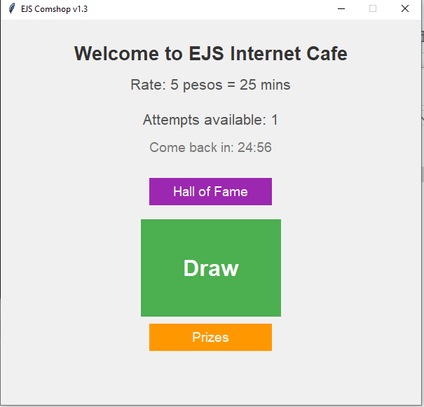

# EJSS-COMSHOP
best tool for computer shop owners


# 🎮 EJS-COMSHOP v1.3 - Internet Cafe Management System

 


## 🌟 Features

### 🎰 Lottery System
- **Time-based attempts**: 1 draw every 25 minutes
- **Progressive rewards**:
  - 5 pesos coin (70% chance)
  - 20 pesos coin (50% chance) 
  - 50 pesos (30% chance)
  - Rivals skin bundle (10% chance)
  - 500 Robux (1% chance)

### ⚡ Admin Control Panel
- **Full-screen notifications** with countdown timer
- **Remote commands**:
  - Send messages to all units
  - Force shutdown computers
  - Adjust speaker volume
  - Trigger message warnings

### 🛡️ Security Features
- **Anti-cheat system** with full-screen warning popup
- **CCTV monitoring alerts**
- **Activity logging** (hidden but accessible)

### 🏆 Community Features
- Hall of Fame integration (Pastebin API)
- Draw history tracking

## 🚀 Installation

```bash
# Clone the repository
https://github.com/3dm4rk/EJSS-COMSHOP.git

# Install dependencies
pip install -r requirements.txt

# Run the application
python EJS-COMSHOP.py
